# Proyecto de Gestión de ramas main y feature – M2C17

## Descripción del Proyecto
Este proyecto corresponde a una práctica de Git y GitHub enfocada en la gestión de repositorios locales y remotos, el uso de ramas y la correcta integración de cambios en la rama principal.

## Actividades Realizadas
- Configuración de un repositorio Git local y su vinculación con GitHub.
- Uso del archivo `.gitignore` para excluir la carpeta `img/`.
- Creación y manejo de ramas de trabajo (`feature/navbar` y `feature/footer`).
- Confirmación de cambios mediante commits descriptivos.
- Integración de las ramas feature a la rama principal `main` utilizando Pull Requests.
- Integración de documentación digital detallando el proceso completo del proyecto.

## Evidencia del Paso a Pasogit add .

### 1. Configuración Inicial y Repositorio Local
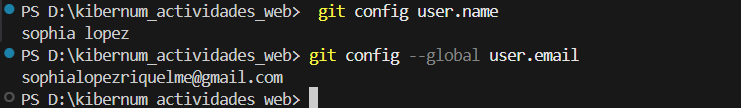
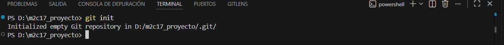
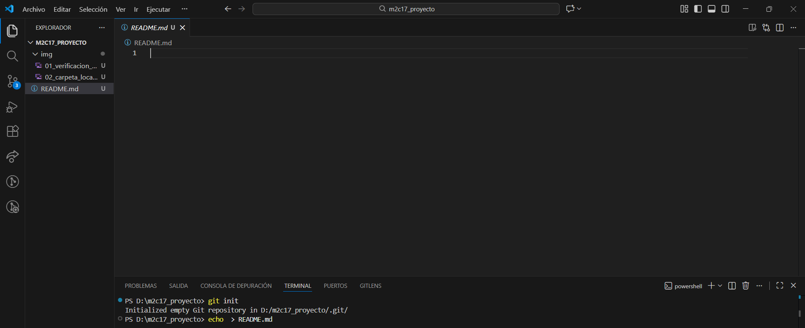
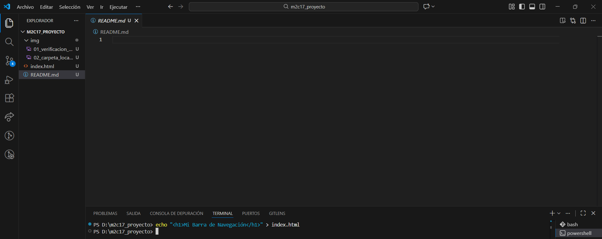
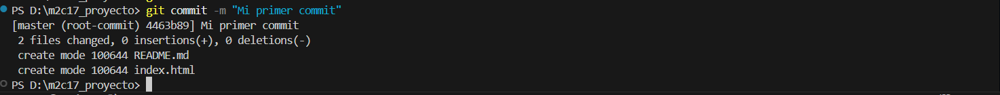

### 2. Vinculación con GitHub y Uso de .gitignore
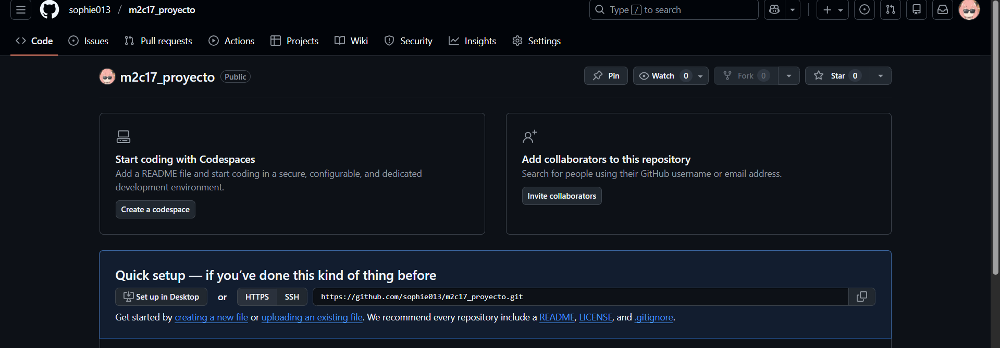
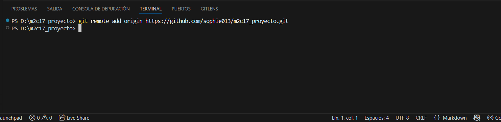
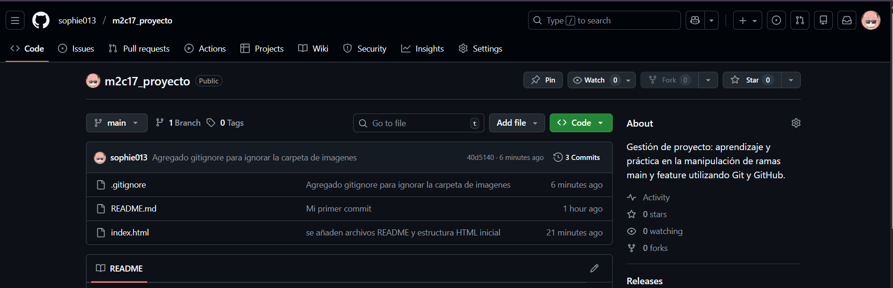

### 3. Trabajo con Ramas (Feature Branches)
#### Rama: feature/navbar
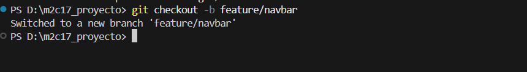
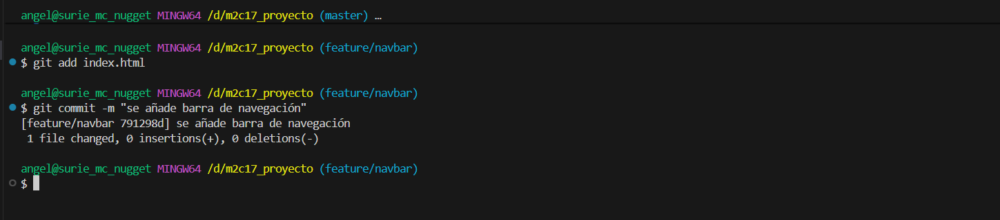
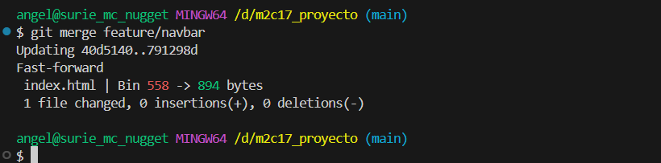

#### Rama: feature/footer
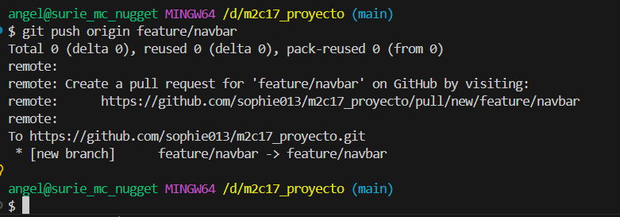
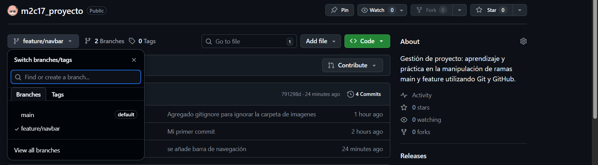

### 4. Gestión de Pull Requests en GitHub
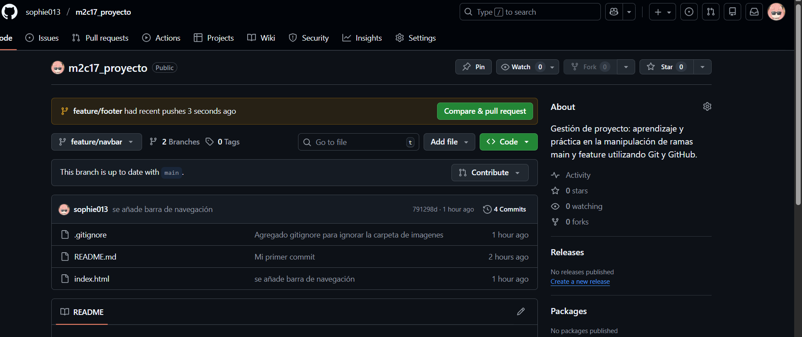
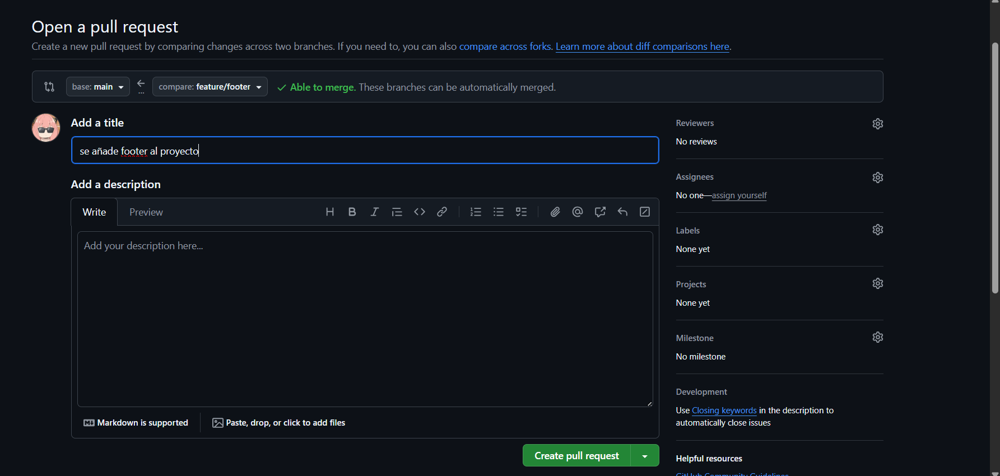
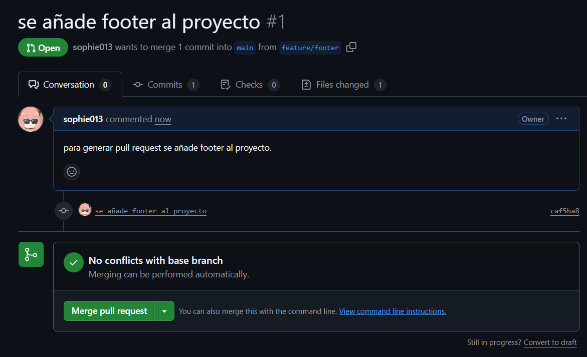
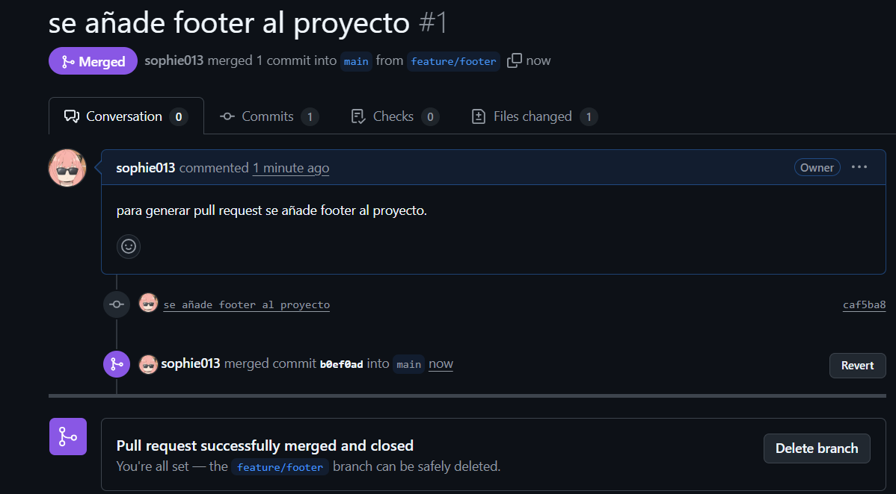

### 5. Documentación Final
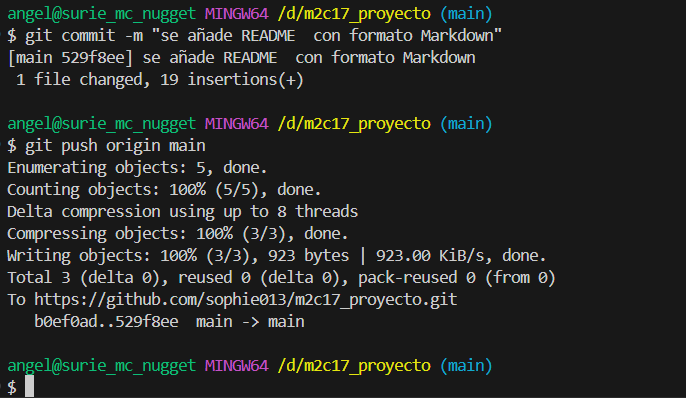
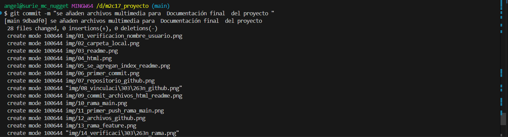

## Resultado
Los cambios desarrollados en las ramas feature fueron integrados exitosamente en la rama `main`, manteniendo un flujo de trabajo ordenado y un historial de versiones claro.

## Conclusión
El uso de ramas y Pull Requests en Git permite trabajar de forma organizada y segura, facilitando la integración de nuevas funcionalidades sin afectar directamente la rama principal del proyecto.